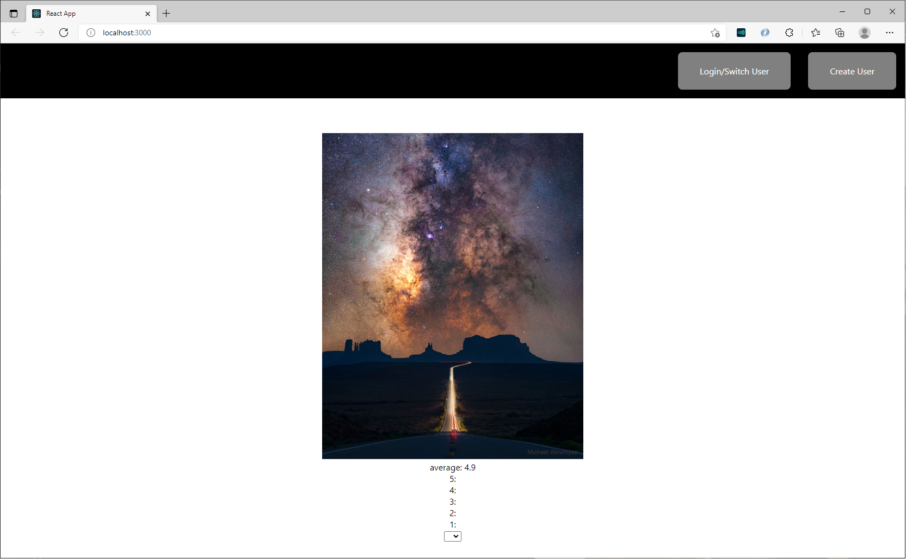

<div id="top"></div>
<!--
*** Thanks for checking out the Best-README-Template. If you have a suggestion
*** that would make this better, please fork the repo and create a pull request
*** or simply open an issue with the tag "enhancement".
*** Don't forget to give the project a star!
*** Thanks again! Now go create something AMAZING! :D
-->

<!-- PROJECT SHIELDS -->
<!--
*** I'm using markdown "reference style" links for readability.
*** Reference links are enclosed in brackets [ ] instead of parentheses ( ).
*** See the bottom of this document for the declaration of the reference variables
*** for contributors-url, forks-url, etc. This is an optional, concise syntax you may use.
*** https://www.markdownguide.org/basic-syntax/#reference-style-links
-->

[![Contributors][contributors-shield]][contributors-url]
[![Forks][forks-shield]][forks-url]
[![Stargazers][stars-shield]][stars-url]
[![Issues][issues-shield]][issues-url]
[![MIT License][license-shield]][license-url]
[![LinkedIn][linkedin-shield]][linkedin-url]

<!-- PROJECT LOGO -->
<br />
<div align="center">
  <a href="https://github.com/simplisticmartin/NASA_API_APPLICATION">

  </a>

<h3 align="center">Nasa picture of the day </h3>

  <p align="center">
    Currently, this project hasn't entirely been complete. Where the application I have built lies is in the /fullstack directory
    client and server both connect to my mongo atlas db but I need some help/time currently to put things together.
  </p>
</div>

<!-- TABLE OF CONTENTS -->
<details>
  <summary>Table of Contents</summary>
 
</details>

<!-- ABOUT THE PROJECT -->

## About The Project



Currently, this project hasn't entirely been complete. Where the application I have built lies is in the /fullstack

client and server both connect to my mongo atlas db but I need some help/time currently to put things together.

<p align="right">(<a href="#top">back to top</a>)</p>

### Built With

- [React.js](https://reactjs.org/)

<p align="right">(<a href="#top">back to top</a>)</p>

<!-- GETTING STARTED -->

## Getting Started

This is an example of how you may give instructions on setting up your project locally.
To get a local copy up and running follow these simple example steps.

### Prerequisites

This is an example of how to list things you need to use the software and how to install them.

- npm
  ```sh
  npm install npm@latest -g
  ```

### Installation

1. Get a free API Key at [https://example.com](https://example.com)
2. Clone the repo
   ```sh
   git clone https://github.com/simplisticmartin/NASA_API_APPLICATION.git
   ```
3. Install NPM packages
   ```sh
   npm install
   ```
4. Create a `config.env` in /server (same level as package.json) Obtain free cluster at MongoAtlas containing:
   ```js
   ATLAS_URI=(Copy and Paste Data)
   PORT=5000
   ```
   Create a `.env` in /client and obtain a free api key at https://api.nasa.gov/index.html (same level as pacakge.json)
   ```js
   REACT_APP_NASA_ENDPOINT=https://api.nasa.gov/
   REACT_APP_NASA_API_KEY=(place apikey and remove parenthesis)
   ```

<p align="right">(<a href="#top">back to top</a>)</p>

<!-- USAGE EXAMPLES -->

## Usage

Use this space to show useful examples of how a project can be used. Additional screenshots, code examples and demos work well in this space. You may also link to more resources.

Make sure you execute

```
npm install
npm install -g nodemon
nodemon server

```

in /server on your terminal

Make sure you execute

```
npm install
npm start

```

in /client on your terminal

in order to get the ground running

<p align="right">(<a href="#top">back to top</a>)</p>

<!-- ROADMAP -->

## Roadmap

- I have to
- [] Feature 2
- [] Feature 3
  - [] Nested Feature

See the [open issues](https://github.com/simplisticmartin/NASA_API_APPLICATION/issues) for a full list of proposed features (and known issues).

<p align="right">(<a href="#top">back to top</a>)</p>

<!-- CONTRIBUTING -->

<p align="right">(<a href="#top">back to top</a>)</p>

<!-- LICENSE -->

## License

Distributed under the MIT License. See `LICENSE.txt` for more information.

<p align="right">(<a href="#top">back to top</a>)</p>

<!-- CONTACT -->

## Contact

Project Link: [https://github.com/simplisticmartin/NASA_API_APPLICATION](https://github.com/simplisticmartin/NASA_API_APPLICATION)

<p align="right">(<a href="#top">back to top</a>)</p>

<!-- ACKNOWLEDGMENTS -->

## Acknowledgments

- []()
- []()
- []()

<p align="right">(<a href="#top">back to top</a>)</p>

<!-- MARKDOWN LINKS & IMAGES -->
<!-- https://www.markdownguide.org/basic-syntax/#reference-style-links -->

[contributors-shield]: https://img.shields.io/github/contributors/simplisticmartin/NASA_API_APPLICATION.svg?style=for-the-badge
[contributors-url]: https://github.com/simplisticmartin/NASA_API_APPLICATION/graphs/contributors
[forks-shield]: https://img.shields.io/github/forks/simplisticmartin/NASA_API_APPLICATION.svg?style=for-the-badge
[forks-url]: https://github.com/simplisticmartin/NASA_API_APPLICATION/network/members
[stars-shield]: https://img.shields.io/github/stars/simplisticmartin/NASA_API_APPLICATION.svg?style=for-the-badge
[stars-url]: https://github.com/simplisticmartin/NASA_API_APPLICATION/stargazers
[issues-shield]: https://img.shields.io/github/issues/simplisticmartin/NASA_API_APPLICATION.svg?style=for-the-badge
[issues-url]: https://github.com/simplisticmartin/NASA_API_APPLICATION/issues
[license-shield]: https://img.shields.io/github/license/simplisticmartin/NASA_API_APPLICATION.svg?style=for-the-badge
[license-url]: https://github.com/simplisticmartin/NASA_API_APPLICATION/blob/master/LICENSE.txt
[linkedin-shield]: https://img.shields.io/badge/-LinkedIn-black.svg?style=for-the-badge&logo=linkedin&colorB=555
[linkedin-url]: https://linkedin.com/in/linkedin_username
[product-screenshot]: images/screenshot.png
